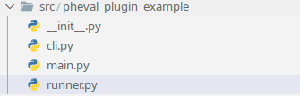

# Developing a PhEval Plugin

## Description
Plugin development allows PhEval to be extensible, as we have designed it.
The plugin goal is to be flexible through custom runner implementations. This plugin development enhances the PhEval functionality. You can build one quickly using this step-by-step process.


==*All custom Runners implementations must implement all* **PhevalRunner** *methods*==
::: src.pheval.runners.runner.PhEvalRunner
    handler: python
    options:
      members:
        - PhEvalRunner
      show_root_heading: false
      show_source: true


---

## Step-by-Step Plugin Development Process

The plugin structure is derived from a [cookiecutter](https://cookiecutter.readthedocs.io/en/stable/) template, [Sphintoxetry-cookiecutter](https://github.com/hrshdhgd/sphintoxetry-cookiecutter), and it uses [Sphinx](https://www.sphinx-doc.org/en/master/), [tox](https://tox.wiki/en/latest/) and [poetry](https://python-poetry.org) as core dependencies.
This allows PhEval extensibility to be standardized in terms of documentation and dependency management.

### 1. Sphintoxetry-cookiecutter scaffold
First, install the cruft package. Cruft enables keeping projects up-to-date with future updates made to this original template.

Install cruft from pip

```bash
pip install cruft
```
Next, create a project using the sphintoxetry-cookiecutter template.

```
cruft create https://github.com/hrshdhgd/sphintoxetry-cookiecutter
```

### 2. Further setup

####  Install poetry if you haven't already.
```
pip install poetry
```

#### Install dependencies

```
poetry install
```

#### Add PhEval dependency

```
poetry add pheval
```

#### Run tox to see if the setup works

```
poetry run tox
```

### 3. Implement PhEval Custom Runner

*The runner name is arbitrary and custom Runner name was chose by demonstrative purposes*

Create a runner file inside the plugin project, e.g:



```python
"""Custom Pheval Runner"""
from dataclasses import dataclass

import click
from pheval.runners.runner import PhEvalRunner


@dataclass
class CustomPhevalRunner(PhEvalRunner):
    """_summary_"""

    inputdir: click.Path
    testdatadir: click.Path
    tmpdir: click.Path
    outputdir: click.Path
    config: click.Path

    def prepare(self):
        """prepare"""
        print("preparing")

    def run(self):
        """run"""
        print("running with custom pheval Runner")

    def post_process(self):
        """post_process"""
        print("post processing")

```

### 4. Add PhEval Plugins section into the pyproject.toml file

```toml
[tool.poetry.plugins."pheval.plugins"]
customrunner = "pheval_plugin_example.runner:CustomPhevalRunner"
```

==Replace the value above with the path to your custom runner plugin==

### 5. Test it.

To update your custom pheval runner implementation, you must first install the package

```
poetry install
```

Now you have to be able to run PhEval passing your custom runner as parameter. e.g

```
pheval run -i input.txt -t './test' -r 'customphevalrunner' -o out.txt
```
The `-r` parameter stands for your plugin runner class name and it must be entirely lowercase.


Output:

```
preparing
running with custom pheval Runner
post processing
```

Pay attention to "*==running with custom pheval Runner==*" line, this is exactly what we had implemented in the **CustomPhevalRunner** Example