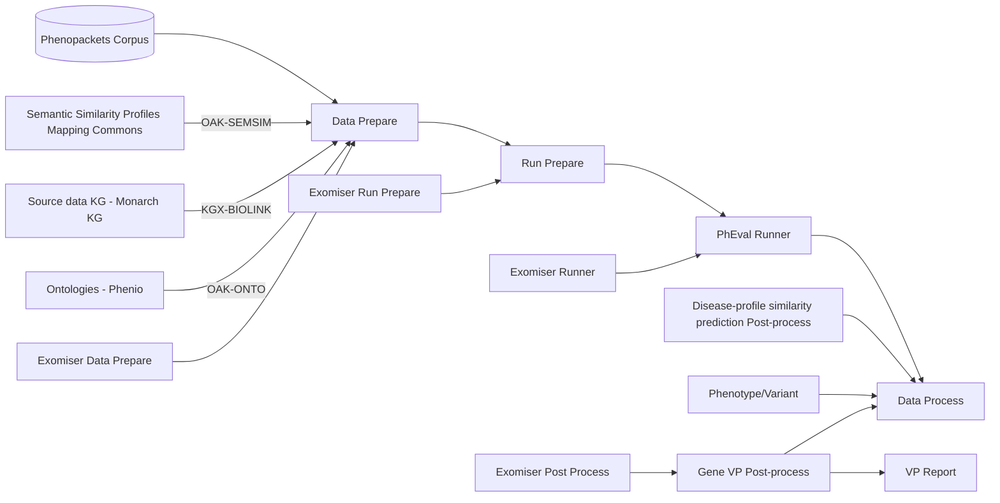

# Home

## Introduction

PhEval - Phenotypic Inference Evaluation Framework

### PhEval: Tool-specific processing (VP pipeline)

**Quick links:**

- [GitHub page](https://github.com/monarch-initiative/pheval/)
