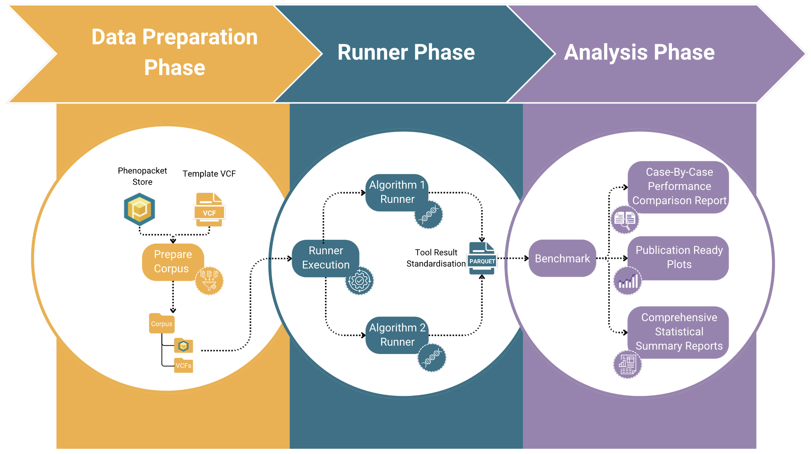

# PhEval

PhEval (Phenotypic Inference Evaluation Framework) is a modular benchmarking framework for evaluating **phenotype-driven prioritisation tools** (e.g. [Exomiser](https://github.com/exomiser/Exomiser)) and related methods that use ontologies, phenotype matching, and semantic similarity.

Phenotype-based methods are widely used in rare disease diagnostics and research, but **robust evaluation is challenging**. Tool performance can change substantially depending on:

- Ontology structure and versioning 
- Phenotype, gene, and disease mappings 
- Semantic similarity methods and scoring strategies 
- Underlying knowledge resources and input cohorts

PhEval was designed to support **fair and reproducible, and controlled evaluation** of these methods by explicitly separating data preparation, tool execution, and analysis, and by standardising how results are represented and compared.

---

## What you can do with PhEval

- Benchmark phenotype-based prioritisation tools on real or simulated cohorts
- Compare results across **tools**, **tool versions**, **ontology versions**, and **knowledge updates**
- Quantify the impact of methodological or knowledge changes on downstream performance
- Produce standardised results suitable for consistent analysis and reporting
- Extend the framework via **plugins** for new tools or workflows
---

## PhEval workflow

PhEval is organised around three core phases: **Data Preparation**, **Runner**, and **Analysis**.

**Data Preparation**

- Phenopackets and/or VCF files
- Ontologies, mappings, and supporting databases

This stage isolates cohort construction and knowledge resources from tool execution.

**Run**

- Tool execution via PhEval runners
- Support for multiple tools and versions
- Standardised execution and output handling

**Analyse** 

- Post-processing into a PhEval standardised results format
- Rank-based and binary classification metrics
- Comparable plots and summaries across runs

---

## Start here

Choose the entry point that best matches what you want to do:

- **Run a phenotype-driven tool under PhEval:**  
  Install a plugin, then execute the tool via its runner using the PhEval CLI  
  (e.g. `pheval run --runner <runner_name>`).  
  → [Plugins](plugins/index.md)
- **Prepare and manipulate input data:**  
  Utilities for preparing phenopackets, creating spiked VCFs, scrambling phenotypes, and updating resources.  
  → [Utilities and data preparation](utilities/)
- **Benchmark and analyse results:**  
  Compare PhEval-standardised results across tools, versions, and experimental conditions.  
  → [Benchmarking](benchmarking/executing_a_benchmark.md)

- **Extend PhEval:**  
  Implement new runners or customise workflows by writing plugins.  
  → [Developing a PhEval Plugin](resources_for_contributors/developing_a_pheval_plugin.md)
- **Developer reference:**  
  Implementation details.  
  → [API Documentation](resources_for_contributors/api_reference/index.md)

---

## Who is PhEval for?

- Researchers developing or evaluating phenotype-driven prioritisation methods
- Teams assessing the impact of tool, ontology, or knowledge updates
- Ontology and knowledge-graph developers studying downstream effects
- Anyone needing **transparent, repeatable benchmarking** over phenotyped cohorts

---

## Project links

- Source code and issues: <https://github.com/monarch-initiative/pheval>

---

## Contact and support

For bugs, feature requests, or questions:

- Open an issue on GitHub (preferred)
- Use the contact details listed in the repository

PhEval is developed as part of the Monarch Initiative ecosystem.
