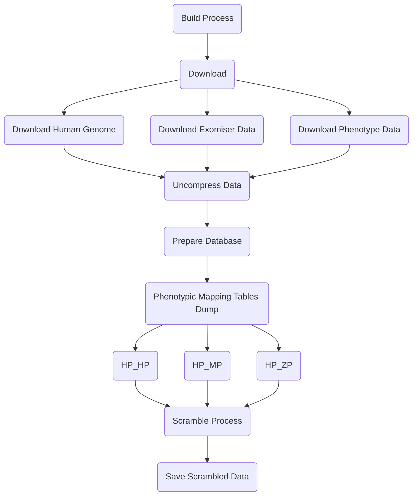

# Makefile Use Cases
- [Makefile Use Cases](#makefile-use-cases)
  - [Command Line Options](#command-line-options)
  - [**Use Case:** PhEval - Scrambling process](#use-case-pheval---scrambling-process)
    - [**Description:** The data workflow implemented using Makefile](#description-the-data-workflow-implemented-using-makefile)
    - [Example of data structure generated by build process:](#example-of-data-structure-generated-by-build-process)
  - [**Use Case:** PhEval - Clean Data](#use-case-pheval---clean-data)
## Command Line Options

---

```
build           :Run download unzip and build targets
download        :Download exomiser, human genome and phenotypic data
unzip           :Unzip all download files from download target.
prepare_dataset :Dump tables from phenotypic H2 database, scramble and save them in tsv files
clean           :Remove all downloaded unzipped and dumped data.
flags
                 EXOMISER: sets exomiser version (default: 13.1.0)
                 HG: sets human genome version (default: hg19)
                 PHENOTYPE: sets phenotype version (default: 2209)
                 SCRAMBLE_FACTOR: sets scramble factor (default: 0.5)

                 Example: make build EXOMISER=13.0.1 HG=hg19 PHENOTYPE=2209
                 Simplified example version using default values: make build

```

## **Use Case:** PhEval - Scrambling process

### **Description:** The data workflow implemented using Makefile



---

### Example of data structure generated by build process:

```
📦inputs
 ┗ 📂data
 ┃ ┣ 📂run_exomiser13.1.0
 ┃ ┃ ┣ 📜HP_HP_MAPPINGS.tsv
 ┃ ┃ ┣ 📜HP_MP_MAPPINGS.tsv
 ┃ ┃ ┗ 📜HP_ZP_MAPPINGS.tsv
 ┃ ┣ 📂run_exomiser13.1.0_scrambled_1
 ┃ ┃ ┗ 📜HP_HP_MAPPINGS.tsv
 ┃ ┗ 📂run_exomiser13.1.0_scrambled_2
 ┃ ┃ ┣ 📜HP_HP_MAPPINGS.tsv
 ┃ ┃ ┣ 📜HP_MP_MAPPINGS.tsv
 ┃ ┃ ┗ 📜HP_ZP_MAPPINGS.tsv
```

---

## **Use Case:** PhEval - Clean Data

 **Description:** The clean target


```mermaid
 flowchart TD
  c(Clean) -->
  r(Remove - rm -r) -->
  e(Exomiser Data)
  r -->
  h(Human Genome Data)
  r -->
  p(Phenotypic Data)
  r -->
  s(Scrambled Data)