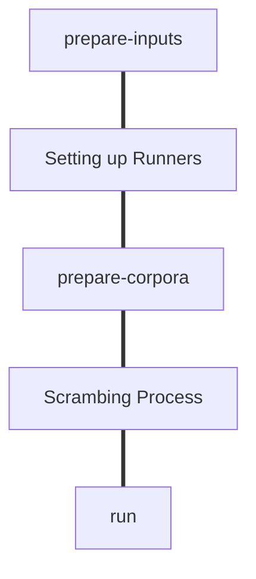

# PhEval Pipeline


## Step by Step to PhEval Run Pipeline (with PhEvalRunner)

### 1. Download [Exomiser Software](https://github.com/exomiser/Exomiser/releases)
```bash
wget https://github.com/exomiser/Exomiser/releases/download/13.2.0/exomiser-cli-13.2.0-distribution.zip
```
### 2. Download Phenotype Data
```bash
wget https://data.monarchinitiative.org/exomiser/latest/2302_hg19.zip
wget https://data.monarchinitiative.org/exomiser/latest/2302_hg38.zip
wget https://data.monarchinitiative.org/exomiser/latest/2302_phenotype.zip
```

### 3. Unzip data

  ```bash
  # unzip the distribution and data files - this will create a directory called 'exomiser-cli-13.1.0' in the current working directory
  unzip exomiser-cli-13.2.0-distribution.zip
  unzip 2302_*.zip -d exomiser-cli-13.2.0/data
  ```

### 4. Clone [PhEval](https://github.com/monarch-initiative/pheval)
  ```bash
  git clone https://github.com/monarch-initiative/pheval.git
  ```

### 5. Installing PhEval dependencies
   Enter in the cloned folder and enter the following commands:

```bash
poetry shell
poetry install
```

### 6. Generate custom Makefile
You must have Jinja2 installed, if you don't follow the steps [here](#installing-jinja-template)

In resources folder are the following files responsible for makefile generation:

📦resources  
 ┣ 📜Makefile.j2  
 ┣ 📜custom.Makefile  
 ┣ 📜generatemakefile.sh  
 ┗ 📜pheval-config.yaml  

You must edit the `pheval-config.yaml` file setting the directory where you extracted exomiser and phenotype data. An example could be found [here](#pheval-configuration-file).
After setting the pheval-config.yaml file

---



---

## Data Flow


## Jinja Template PhEval Makefile Generator Requirements

To generate a PhEval Makefile we use the [Jinja](https://jinja.palletsprojects.com/en/3.1.x/) template engine.

### Installing Jinja Template

- Linux (Ubuntu): `sudo snap install j2`

- Mac OS:

---
## PhEval Makefile Template (.j2 file)

📦resources  
 ┣ 📜**Makefile.j2**  


*custom.Makefile* is the template that will be generated on the fly based on the *pheval-config.yaml*. Each of these configurations is filled using a syntax like this: ```{{ config.tool }}```. The value between the curly brackets is replaced by the corresponding configuration in the configuration file.

---

## PhEval custom.Makefile

📦resources  
 ┣ 📜**custom.Makefile**  

---
## PhEval generatemakefile.sh

📦resources  
 ┣ **📜generatemakefile.sh**  


*generatemakefile.sh* is only a shortcut for Makefile rendering using the configuration file e.g.

    bash ./resources/generatemakefile.sh

## PhEval Configuration File

In resources folder, there is a file named *pheval-config.yaml*, this file is responsible for storing the PhEval Makefile generation.

📦resources  
 ┗ **📜pheval-config.yaml**  

### Phenotype Section
```yaml
phenotype:
  version: 2302
  hg: hg19
  url: https://data.monarchinitiative.org/exomiser/latest/
```

---

### Directories Section
```yaml
directories:
  tmp: data/tmp
  testdata: testdata
  config: configurations
  h2jar: /home/vinicius/.local/share/DBeaverData/drivers/maven/maven-central/com.h2database/h2-1.4.199.jar
  phen2gene: /pathtoPhen2Gene/Phen2Gene
  exomiser: /pathto/exomiser
  phenotype: /pathto/exomiser-data/2302_phenotype
  workspace: /pathto/workspace
```

---

### Configs Section
```yaml
configs:
  - tool: phen2gene
    version: 1.2.3
    configuration: default
  - tool: exomiser
    version: 13.2.0
    configuration: default
    exomiser_db: semsim1
```

This section is responsible for setting up the configuration folder.
All software declared in the configs section will be linked in this folder.
In the configuration above, for example, we have one configuration for phen2gene and one for exomiser. In the [Directories Section](#directories-section), these two configurations must have one corresponding property set up.
PhEval pipeline invokes the *prepare-inputs* goal, and in the preceding example, a configuration folder structure will be built that looks like this:

📦configurations  
 ┣ 📂exomiser-13.2.0-default  
 ┗ 📂phen2gene-1.2.3-default  


Each of these folders is a symbolic link that points to the corresponding software folder indicated in the [Directories Section](#directories-section)

---

### Corpora Section
```yaml
corpora:
  - id: lirical
    scrambled:
      - factor: 0.5
      - factor: 0.7
    custom_variants:
      - id: no_phenotype
  - id: phen2gene
    scrambled:
      - factor: 0.2
      - factor: 0.9
    custom_variants:
      - id: no_phenotype
```

In this corpora section we can set up different experiments for corpus scrambling. Currently, PhEval provides corpora data from lirical, phen2gene, small_test and structural_variants


📦corpora  
 ┣ 📂lirical  
 ┣ 📂phen2gene  
 ┣ 📂small_test  
 ┗ 📂structural_variants  


The scramble property defines the magnitude of the scrambling factor during Phenopackets and VCF variants spiking process. Using the configuration in the example above, a corpora structure will be created like this:

📦corpora  
 ┣ 📂lirical  
 ┃ ┗ 📂default  
 ┃ ┗ 📂scrambled-0.5  
 ┃ ┗ 📂scrambled-0.7  
 ┣ 📂phen2gene  
 ┃ ┗ 📂default  
 ┃ ┗ 📂scrambled-0.2  
 ┃ ┗ 📂scrambled-0.9  


---

### Runs Section
```yaml
runs:
  - tool: exomiser
    configuration: default
    corpus: lirical
    corpusvariant: scrambled-0.5
    version: 13.2.0
  - tool: phen2gene
    configuration: default
    corpus: phen2gene
    corpusvariant: scrambled-0.2
    version: 1.2.3
```

## Exomiser Specific Configuration

### Exomiser Runner requires the following configuration

Configuring the application.properties:

The input directory `config.yaml` should be formatted like the example below and must be placed in `exomiser: /pathto/exomiser` declared in `pheval-config.yaml` file.

```yaml
tool: exomiser
tool_version: 13.2.0
phenotype_only: False # NOTE phenotype-only preset analysis should only be run with Exomiser versions >= 13.2.0
tool_specific_configuration_options:
  environment: local
  exomiser_software_directory: exomiser-cli-13.2.0
  analysis_configuration_file: preset-exome-analysis.yml
  max_jobs: 0
  application_properties:
    remm_version:
    cadd_version:
    hg19_data_version: 2302
    hg19_local_frequency_path:
    hg38_data_version: 2302
    phenotype_data_version: 2302
    cache_type:
    cache_caffeine_spec:
  post_process:
    score_name: combinedScore
    sort_order: DESCENDING
```

## Phen2Gen Specific Configuration


The input directory `config.yaml` should be formatted like the example below and must be placed in `phen2gene: /pathtoPhen2Gene/Phen2Gene` declared in `pheval-config.yaml` file.

```yaml
tool: phen2gene
tool_version: 1.2.3
phenotype_only: True
tool_specific_configuration_options:
  environment: local
  phen2gene_python_executable: phen2gene.py
  post_process:
    score_order: descending
```

## Makefile Goals

### make pheval

this runs the entire pipeline including corpus preparation and pheval run


	$(MAKE) prepare-inputs
	$(MAKE) prepare-corpora
	$(MAKE) pheval-run


### make semsim

generate all configured similarity profiles

### make semsim-shuffle

generate new ontology terms to the semsim process

### make semsim-scramble

scramble semsim profile

### make semsim-convert

convert all semsim profiles into exomiser SQL format

### make semsim-ingest

takes all the configured semsim profiles and loads them into the exomiser databases
