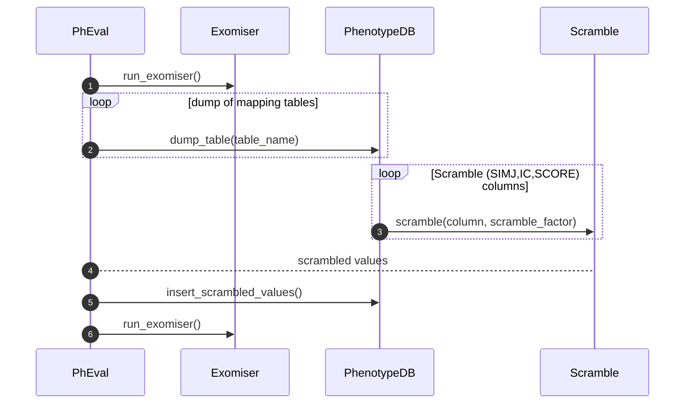

# Use Case - PhEval

## **Id:** UC-01

### **Use Case:** PhEval - Exomiser Scrambling process

### **Description:** PhEval runs the exomiser with the default configurations first. Next, PhEval scrambles the phenotypic mapping tables from the exomiser using a scalar factor. Scrambled values are stored in the phenotypic database. Finally, the exomiser runs using the updated scrambled values.

